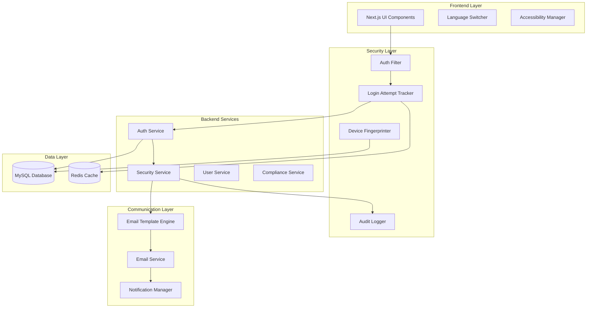

# Design Document

## Overview

The Platform Security Enhancements feature extends the existing Nagar Sewak Platform with comprehensive security controls, advanced email communication systems, and accessibility features. The design builds upon the current Spring Boot backend with JWT authentication and Next.js frontend to add brute-force protection, device tracking, multi-language support, and accessibility compliance.

The system implements a layered security approach with real-time monitoring, automated threat response, and user-friendly security notifications while maintaining platform usability and performance.

## Architecture

### High-Level Architecture



### Security Architecture

The security layer implements multiple defense mechanisms:

- **Authentication Filter**: Enhanced JWT filter with attempt tracking
- **Login Attempt Tracker**: Redis-based counter with automatic reset
- **Device Fingerprinter**: Browser/OS/IP-based device identification
- **Audit Logger**: Comprehensive security event logging
- **Account Locker**: Temporary account suspension with email alerts

## Components and Interfaces

### Backend Components

#### LoginAttemptService
```java
@Service
public class LoginAttemptService {
    int getFailedAttempts(String email);
    void recordFailedAttempt(String email, String ipAddress);
    void resetFailedAttempts(String email);
    boolean isAccountLocked(String email);
    void lockAccount(String email);
}
```

#### DeviceFingerprintService
```java
@Service
public class DeviceFingerprintService {
    DeviceFingerprint createFingerprint(HttpServletRequest request);
    boolean isKnownDevice(String userId, DeviceFingerprint fingerprint);
    void registerDevice(String userId, DeviceFingerprint fingerprint);
    List<TrustedDevice> getUserDevices(String userId);
}
```

#### SecurityAuditService
```java
@Service
public class SecurityAuditService {
    void logSecurityEvent(SecurityEventType type, String userId, String ipAddress, Map<String, Object> details);
    Page<SecurityAuditLog> getSecurityLogs(String userId, Pageable pageable);
    List<SecurityAuditLog> getRecentSuspiciousActivity();
}
```

#### EmailTemplateService
```java
@Service
public class EmailTemplateService {
    String renderTemplate(EmailTemplateType type, Map<String, Object> variables);
    void sendSecurityAlert(String email, SecurityAlertType alertType, Map<String, Object> context);
    void sendAccountLockNotification(String email, AccountLockContext context);
    void sendNewDeviceAlert(String email, DeviceLoginContext context);
}
```

### Frontend Components

#### SecurityAlertModal
```typescript
interface SecurityAlertModalProps {
  isOpen: boolean;
  attemptCount: number;
  maxAttempts: number;
  onClose: () => void;
}
```

#### LanguageSwitcher
```typescript
interface LanguageSwitcherProps {
  currentLocale: string;
  availableLocales: string[];
  onLanguageChange: (locale: string) => void;
}
```

#### AccessibilityProvider
```typescript
interface AccessibilityContextType {
  highContrast: boolean;
  fontSize: 'normal' | 'large' | 'extra-large';
  reducedMotion: boolean;
  toggleHighContrast: () => void;
  setFontSize: (size: string) => void;
}
```

## Data Models

### Security Models

#### LoginAttempt
```java
@Entity
public class LoginAttempt {
    @Id
    private Long id;
    private String email;
    private String ipAddress;
    private LocalDateTime attemptTime;
    private boolean successful;
    private String userAgent;
    private String location;
}
```

#### DeviceFingerprint
```java
@Entity
public class DeviceFingerprint {
    @Id
    private Long id;
    private String userId;
    private String browserType;
    private String operatingSystem;
    private String deviceType;
    private String ipAddress;
    private String fingerprintHash;
    private LocalDateTime firstSeen;
    private LocalDateTime lastSeen;
    private boolean trusted;
}
```

#### SecurityAuditLog
```java
@Entity
public class SecurityAuditLog {
    @Id
    private Long id;
    private String userId;
    private SecurityEventType eventType;
    private String ipAddress;
    private LocalDateTime timestamp;
    private String details; // JSON
    private String userAgent;
    private String location;
}
```

### Communication Models

#### EmailTemplate
```java
@Entity
public class EmailTemplate {
    @Id
    private Long id;
    private EmailTemplateType type;
    private String subject;
    private String htmlContent;
    private String textContent;
    private String language;
    private boolean active;
}
```

#### EmailHistory
```java
@Entity
public class EmailHistory {
    @Id
    private Long id;
    private String recipientEmail;
    private EmailTemplateType templateType;
    private String subject;
    private LocalDateTime sentAt;
    private EmailStatus status;
    private String errorMessage;
    private int retryCount;
}
```

### User Preference Models

#### NotificationPreference
```java
@Entity
public class NotificationPreference {
    @Id
    private Long id;
    private String userId;
    private NotificationType type;
    private boolean enabled;
    private DeliveryMethod deliveryMethod;
}
```

#### AccessibilityPreference
```java
@Entity
public class AccessibilityPreference {
    @Id
    private Long id;
    private String userId;
    private boolean highContrast;
    private String fontSize;
    private boolean reducedMotion;
    private boolean screenReaderMode;
}
```
## Correctness Properties

*A property is a characteristic or behavior that should hold true across all valid executions of a system-essentially, a formal statement about what the system should do. Properties serve as the bridge between human-readable specifications and machine-verifiable correctness guarantees.*

After analyzing the acceptance criteria, the following properties have been identified for property-based testing. Some criteria were determined to be non-testable due to their subjective nature (UI aesthetics, translation quality) or implementation-specific details (email client compatibility).

### Security Properties

**Property 1: Failed attempt tracking consistency**
*For any* user account and sequence of failed login attempts, the system should accurately increment the failed attempt counter for each failure
**Validates: Requirements 1.1**

**Property 2: Warning message threshold accuracy**
*For any* user account, when the failed attempt count reaches 3 or 4, the system should display appropriate warning messages indicating remaining attempts
**Validates: Requirements 1.2**

**Property 3: Account lock enforcement**
*For any* user account, when the failed attempt count reaches exactly 5, the system should immediately lock the account for 15 minutes
**Validates: Requirements 1.3**

**Property 4: Successful login counter reset**
*For any* user account with previous failed attempts, successful authentication should reset the failed attempt counter to zero
**Validates: Requirements 1.4**

**Property 5: Account lock email notification**
*For any* account that becomes locked due to failed attempts, the system should send an email alert to the registered email address
**Validates: Requirements 2.1**

**Property 6: Security alert email content completeness**
*For any* security alert email generated, the email content should include timestamp, IP address, and location information
**Validates: Requirements 2.2**

**Property 7: Security alert email instructions**
*For any* security alert email, the content should include clear instructions on next steps for the user
**Validates: Requirements 2.4**

### Device Management Properties

**Property 8: New device login allowance**
*For any* user logging in from an unrecognized device, the login should be allowed to proceed successfully
**Validates: Requirements 3.1**

**Property 9: New device email notification**
*For any* login from a new device, the system should immediately send a security confirmation email
**Validates: Requirements 3.2**

**Property 10: New device alert content completeness**
*For any* new device alert email, the content should include device details, IP address, location, and login timestamp
**Validates: Requirements 3.3**

**Property 11: New device confirmation buttons**
*For any* new device notification email, the content should provide "Yes, it was me" and "No, secure my account" confirmation options
**Validates: Requirements 3.4**

**Property 12: Device fingerprint factors**
*For any* device recognition evaluation, the system should consider browser type, operating system, and IP location as identifying factors
**Validates: Requirements 3.5**

**Property 13: Device fingerprint storage**
*For any* successful login, the system should store device fingerprint information including browser, OS, and device type
**Validates: Requirements 4.1**

**Property 14: Device timestamp recording**
*For any* new device registration, the system should record the first login timestamp
**Validates: Requirements 4.2**

**Property 15: Known device recognition**
*For any* login attempt from a previously stored device, the system should not trigger new device alerts
**Validates: Requirements 4.3**

**Property 16: Device fingerprint comparison**
*For any* device recognition evaluation, the system should compare current device characteristics against all stored fingerprints
**Validates: Requirements 4.4**

### Audit and Compliance Properties

**Property 17: Security event logging completeness**
*For any* security-related event (failed login, account lock, new device login, password change, MFA modification), the system should create an audit log entry
**Validates: Requirements 5.1**

**Property 18: Audit log entry content**
*For any* audit log entry created, it should include user ID, IP address, timestamp, and action type
**Validates: Requirements 5.2**

**Property 19: Audit log chronological ordering**
*For any* sequence of security events, the audit logs should maintain chronological order and be searchable
**Validates: Requirements 5.4**

**Property 20: Data export completeness**
*For any* user data export request, the system should provide all personal data in a structured, machine-readable format
**Validates: Requirements 6.1**

**Property 21: Account deletion data removal**
*For any* account deletion request, the system should permanently remove all personal data while preserving anonymized system records
**Validates: Requirements 6.2**

**Property 22: Password encryption consistency**
*For any* user password stored in the system, it should be encrypted using BCrypt or Argon2 algorithms
**Validates: Requirements 6.3**

**Property 23: Authentication token security**
*For any* authentication token generated, stored, or validated, the system should implement secure mechanisms throughout the token lifecycle
**Validates: Requirements 6.4**

### Communication Properties

**Property 24: Email template usage consistency**
*For any* system email sent (security alerts, device notifications, account warnings, password resets, complaint updates), the system should use appropriate HTML templates
**Validates: Requirements 7.1**

**Property 25: Email branding consistency**
*For any* generated email, the content should include consistent branding elements (logos, colors, typography)
**Validates: Requirements 7.3**

**Property 26: Asynchronous email sending**
*For any* security event that triggers email notifications, the emails should be sent asynchronously without blocking user interactions
**Validates: Requirements 8.1**

**Property 27: Email retry mechanism**
*For any* failed email delivery, the system should implement retry mechanisms with exponential backoff
**Validates: Requirements 8.2**

**Property 28: Security notification completeness**
*For any* suspicious activity detected, the system should generate appropriate email notifications
**Validates: Requirements 8.3**

**Property 29: Email queue processing integrity**
*For any* email queue processing, the system should maintain delivery order and handle failures gracefully
**Validates: Requirements 8.4**

### User Preference Properties

**Property 30: Notification preference control**
*For any* user configuring notification settings, the system should allow enabling or disabling system notifications and complaint updates
**Validates: Requirements 9.1**

**Property 31: Security alert preference restrictions**
*For any* user attempting to disable security alert preferences, the system should prevent complete disabling of critical security notifications
**Validates: Requirements 9.2**

**Property 32: Preference change immediacy**
*For any* email preference update, the changes should apply immediately to future notifications
**Validates: Requirements 9.3**

**Property 33: Email history logging**
*For any* email processed by the system, a history log should be maintained with delivery status
**Validates: Requirements 10.1**

**Property 34: Email history content completeness**
*For any* email history log entry, it should record timestamps, recipients, and success or failure status
**Validates: Requirements 10.2**

**Property 35: Email delivery status tracking**
*For any* email delivery tracking, the system should distinguish between sent, delivered, failed, and retry states
**Validates: Requirements 10.4**

### Internationalization Properties

**Property 36: Multi-language platform support**
*For any* user accessing the platform, the system should support Hindi and English languages with framework capability for additional languages
**Validates: Requirements 11.1**

**Property 37: Content translation completeness**
*For any* user interface content displayed, all elements, labels, and system messages should be translated appropriately
**Validates: Requirements 11.2**

**Property 38: Language preference persistence**
*For any* user language selection, the choice should persist across all future sessions
**Validates: Requirements 11.3**

**Property 39: Language switcher global availability**
*For any* platform page navigation, a globally accessible language switcher component should be displayed
**Validates: Requirements 12.1**

**Property 40: Language change immediacy**
*For any* language selection change, the interface should update immediately without requiring page reload
**Validates: Requirements 12.2**

**Property 41: Language preference storage**
*For any* language preference change, the system should remember the user's choice for future visits
**Validates: Requirements 12.3**

**Property 42: Language option display format**
*For any* language switcher display, language options should be shown in both native script and English
**Validates: Requirements 12.4**

### Accessibility Properties

**Property 43: Screen reader compatibility**
*For any* assistive technology user, the platform should provide full screen reader compatibility with proper ARIA labels and semantic markup
**Validates: Requirements 13.1**

**Property 44: Keyboard navigation completeness**
*For any* user navigating without a mouse, the platform should support complete keyboard-only navigation with visible focus indicators
**Validates: Requirements 13.2**

**Property 45: High contrast mode availability**
*For any* user requiring visual assistance, the platform should offer high-contrast mode with sufficient color contrast ratios
**Validates: Requirements 13.3**

**Property 46: Interactive element accessibility**
*For any* form or button interaction, the platform should provide clear, descriptive labels and error messages for all interactive elements
**Validates: Requirements 13.4**

## Error Handling

### Security Error Scenarios

**Authentication Failures**
- Invalid credentials: Return generic error message to prevent user enumeration
- Account locked: Display lock duration and provide account recovery options
- Token expired: Redirect to login with session timeout message
- Suspicious activity: Log event and trigger security notifications

**Device Recognition Errors**
- Fingerprint generation failure: Fall back to IP-based recognition
- Database connectivity issues: Allow login but queue device registration for retry
- Email service unavailable: Log notification failure and retry asynchronously

**Rate Limiting Errors**
- API rate limits exceeded: Return 429 status with retry-after header
- Email sending limits: Queue emails and implement exponential backoff
- Database connection pool exhaustion: Implement circuit breaker pattern

### Communication Error Scenarios

**Email Delivery Failures**
- SMTP server unavailable: Queue emails for retry with exponential backoff
- Invalid email addresses: Log error and notify administrators
- Template rendering errors: Fall back to plain text notifications
- Attachment size limits: Compress or split large attachments

**Template Processing Errors**
- Missing template variables: Use default values and log warnings
- Template compilation failures: Fall back to basic templates
- Localization errors: Default to English with error logging

### Data Integrity Error Scenarios

**Audit Log Failures**
- Database write failures: Queue audit events for retry
- Log corruption: Implement checksums and backup mechanisms
- Storage capacity issues: Implement log rotation and archival

**Compliance Data Errors**
- Export generation failures: Provide partial exports with error notifications
- Deletion process interruptions: Implement transaction rollback and retry
- Encryption key rotation: Maintain backward compatibility during transitions

## Testing Strategy

### Dual Testing Approach

The testing strategy implements both unit testing and property-based testing to ensure comprehensive coverage:

**Unit Testing Focus:**
- Specific examples demonstrating correct behavior
- Edge cases and boundary conditions
- Integration points between security components
- Error handling scenarios and recovery mechanisms

**Property-Based Testing Focus:**
- Universal properties that should hold across all inputs
- Security invariants that must never be violated
- Data consistency across different user scenarios
- System behavior under various load conditions

### Property-Based Testing Framework

**Framework Selection:** The implementation will use **QuickCheck for Java** (net.java.quickcheck) for property-based testing in the Spring Boot backend, integrated with JUnit 5.

**Test Configuration:**
- Each property-based test will run a minimum of 100 iterations
- Custom generators will be created for user accounts, device fingerprints, and security events
- Shrinking will be enabled to find minimal failing examples
- Each property test will include a comment explicitly referencing the design document property

**Test Annotation Format:**
```java
/**
 * Feature: platform-security-enhancements, Property 1: Failed attempt tracking consistency
 * Validates: Requirements 1.1
 */
@Property
public void testFailedAttemptTrackingConsistency() {
    // Property implementation
}
```

### Unit Testing Framework

**Framework Selection:** JUnit 5 with Mockito for mocking external dependencies

**Test Categories:**
- Service layer unit tests for business logic validation
- Repository layer tests for data access verification
- Controller layer tests for API endpoint behavior
- Security filter tests for authentication flow validation

### Integration Testing

**Email Integration Tests:**
- Test email template rendering with various data inputs
- Verify email delivery queue processing
- Validate retry mechanisms under failure conditions

**Security Integration Tests:**
- End-to-end authentication flow testing
- Device fingerprinting across different browsers
- Account locking and recovery workflows

**Accessibility Integration Tests:**
- Screen reader compatibility verification
- Keyboard navigation flow testing
- High contrast mode functionality validation

### Performance Testing

**Load Testing Scenarios:**
- Concurrent login attempts from multiple users
- Email queue processing under high volume
- Database performance with large audit log datasets

**Security Performance Testing:**
- Brute force attack simulation and response times
- Device fingerprinting performance with large device databases
- Audit logging performance under high security event volumes

The testing strategy ensures that both specific examples work correctly (unit tests) and that universal properties hold across all possible inputs (property-based tests), providing comprehensive validation of the security enhancements.